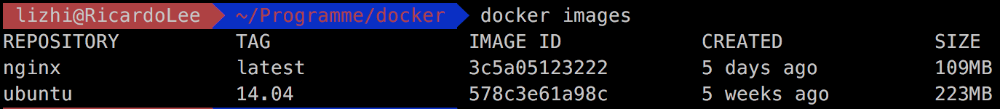
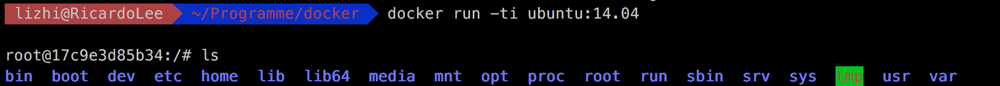

### 安装docker

在Mac下，我是用Docker Toolbox 来安装 Docker，详情参考：https://github.com/widuu/chinese_docker/blob/master/installation/mac.md

### docker基本指令

指令可以直接通过输入docker来了解，下面列举几个常用的指令

```dockerfile
    docker ps: 查看启动的虚拟机进程
    docker images: 查看所有的容器
    docker pull: 下载
    docker commit: 新建保存镜像
    docker run: 启动虚拟机
    这些命令在接下来可以使用到。
```

### 使用Docker创建ubuntu虚拟机

这个会从docker hub的library/ububtu下载.当然你也可以选择其他的仓库，构成方式是：repository:tag的语法结构

```shell
docker pull ubuntu
```

然后使用`docker images`可以查看本地的所有镜像：



显示的内容如下：

```
REPOSITORY：仓库名
TAG：标记,例如hadoop
IMAGE ID：镜像ID号，这是唯一的
CREATED：创建时间
SIZE：镜像大小
那么，除此之外，还需要了解docker的一些常用操作。
```

### 启动Docker

启动docker容器，就可以构建部署hadoop集群了。使用如下命令启动docker容器：

```shell
docker run -ti ubuntu:14.04
```



其中红色框内的一串字符是容器ID,可以在docker images 的 imageID列查看到，这个很有用处。到这里我们就已经搭建完ubuntu虚拟主机了。

接下来我们在Ubuntu基础镜像的上，我们需要安装Hadoop需要的jvm环境，执行如下命令：

```shell
[1] apt-get update  //记得更新，不更新执行下面可能会出错
[2] apt-get install software-properties-common python-software-properties
[3] add-apt-repository ppa:webupd8team/java
[4] apt-get install oracle-java8-installer
[5] export JAVA_HOME=/usr/lib/jvm/java-8-oracle
```

### 安装&配置Hadoop

设置好jvm环境后，下载Hadoop，输入如下命令：

```shell
root@17c9e3d85b34:/usr/lib# cd ~
root@17c9e3d85b34:~# mkdir soft
root@17c9e3d85b34:~# ls
soft
root@17c9e3d85b34:~# cd soft/
root@17c9e3d85b34:~/soft# mkdir apache
root@17c9e3d85b34:~/soft# cd apache/
root@17c9e3d85b34:~/soft/apache# mkdir hadoop
root@17c9e3d85b34:~/soft/apache# pwd
/root/soft/apache
root@17c9e3d85b34:~/soft/apache# wget http://www-us.apache.org/dist/hadoop/common/hadoop-2.7.6/hadoop-2.7.6.tar.gz
root@17c9e3d85b34:~/soft/apache# tar xvzf hadoop-2.7.6.tar.gz
```

这里是在用户目录下，创建一个hadoop文件夹，然后下载hadoop（这里是2.7.6）下来，解压出来。<!--more-->

### 环境配置

现在需要配置环境变量，在~/.bashrc添加java和hadoop文件路径：

```
root@17c9e3d85b34:vi ~/.bashrc
export JAVA_HOME=/usr/lib/jvm/java-8-oracle
export HADOOP_HOME=/root/soft/apache/hadoop/hadoop-2.7.6
export HADOOP_CONFIG_HOME=$HADOOP_HOME/etc/hadoop
export PATH=$PATH:$HADOOP_HOME/bin:$HADOOP_HOME/sbin
```

最后，记得要`source ~/.bashrc`使配置生效，不然没用。

### 配置Hadoop

部署分布式的hadoop，主要分为两大角色：Master和Slave。从HDFS的角度，由若干个NameNode和DataNode组成（在分布式文件系统中，NameNode管理文件系统的命名空间，DataNode管理存储的数据）；从MapReduce的角度，将主机划分JobTracker 和TaskTracker(主节点的Job分配多个Task给从节点执行)。HDFS在集群上实现分布式文件系统，MapReduce在集群上实现了分布式计算和任务处理。HDFS在MapReduce任务处理过程中提供了文件操作和存储等支持，MapReduce在HDFS的基础上实现了任务的分发、跟踪、执行等工作，并收集结果，二者相互作用，完成了Hadoop分布式集群的主要任务[[参考\]](http://blog.chinaunix.net/uid-25266990-id-3900239.html)。

部署hadoop的各个节点，需要修改hadoop的配置文件，包括core-site.xml、hdfs-site.xml、mapred-site.xml这三个文件。在此之前，建议新建如下目录:

- tmp：作为Hadoop的临时目录

- namenode：作为NameNode的存放目录

- datanode：作为DataNode的存放目录

  

```shell
root@17c9e3d85b34:~# cd $HADOOP_HOME/
root@17c9e3d85b34:~/soft/apache/hadoop/hadoop-2.7.6# mkdir tmp
root@17c9e3d85b34:~/soft/apache/hadoop/hadoop-2.7.6# cd tmp/
root@17c9e3d85b34:~/soft/apache/hadoop/hadoop-2.7.6/tmp# cd ../
root@17c9e3d85b34:~/soft/apache/hadoop/hadoop-2.7.6# mkdir namenode
root@17c9e3d85b34:~/soft/apache/hadoop/hadoop-2.7.6# cd namenode/
root@17c9e3d85b34:~/soft/apache/hadoop/hadoop-2.7.6/namenode# cd ../
root@17c9e3d85b34:~/soft/apache/hadoop/hadoop-2.7.6# mkdir datanode
root@17c9e3d85b34:~/soft/apache/hadoop/hadoop-2.7.6# cd datanode/
root@17c9e3d85b34::~/soft/apache/hadoop/hadoop-2.7.6/datanode# cd /etc/hadoop
root@17c9e3d85b34:~/soft/apache/hadoop/hadoop-2.7.6/etc/hadoop# cp mapred-site.xml.template mapred-site.xml

```

接下来进行配置：

**core-site.xml：**

```xml
	<property>
        <name>hadoop.tmp.dir</name>
        <value>/root/soft/apache/hadoop/hadoop-2.7.6/tmp</value>
    </property>
    <property>
        <name>fs.default.name</name>
        <value>hdfs://master:9000</value>
    </property>
```

- hadoop.tmp.dir：配置为/root/soft/apache/hadoop/hadoop-2.7.6/tmp为此前创建的临时目录。
- fs.default.name：配置为hdfs://master:9000，指向Master节点

##### hdfs-site.xml

```xml
    <property>
        <name>dfs.replication</name>
        <value>2</value>
        <final>true</final>
    </property>
    <property>
        <name>dfs.namenode.name.dir</name>
        <value>/root/soft/apache/hadoop/hadoop-2.7.6/namenode</value>
    </property>
    <property>
        <name>dfs.datanode.data.dir</name>
        <value>/root/soft/apache/hadoop/hadoop-2.7.6/datanode</value>
    </property>
```

- dfs.replication：配置为2。指集群为一个Master节点和两个Slave节点。
- dfs.namenode.name.dir：配置为此前创建的NameNode目录
- dfs.datanode.data.dir：配置为此前创建的NaDataNode目录

##### mapred-site.xml

```xml
    <property>
        <name>mapred.job.tracker</name>
        <value>master:9001</value>
    </property>
```

- mapred.job.tracker：配置jobTracker在master节点。

除此之外，还要配置conf/hadoop-env.sh文件,修改为你的jdk的安装位置:

```shell
export JAVA_HOME=/usr/lib/jvm/java-8-oracle
```

最后我们`hadoop namenode -format`来格式化一下Namenode

### 安装SSH&配置机器的访问连接关系

Hadoop启动以后，Namenode是通过SSH来启动和停止各个Datanode上的守护进程的，要求在节点之间执行指令的时候是不需要输入密码，故我们要配置SSH运用无密码公钥认证的形式。

首先，安装SSH

```shell
root@17c9e3d85b34:~# apt-get install ssh
root@17c9e3d85b34:~# ssh localhost
在.bashrc配置：/usr/sbin/sshd
启动sshd服务：service ssh start
```

利用`ssh localhost`测试一下是否设置好无口令登陆，如果没有设置好，系统将要求你输入密码，通过下面的设置可以实现无口令登陆：

```shell
root@17c9e3d85b34:~# ssh-keygen -t rsa -P '' -f ~/.ssh/id_dsa
root@17c9e3d85b34:~# cd .ssh
root@17c9e3d85b34:~# cat id_dsa.pub >> authorized_keys
```

最后，保存一份镜像:

```shell
docker commit -m "java image" 578c3e61a98c  ubuntu:hadoop
```


`-m`后面指定提交说明，578c3e61a98c是容器ID（也可以通过`docker ps`查询运行的容器），`ubuntu:hadoop`是仓库，`:java`是标记。

### 启动Hadoop集群

接下来就是启动hadoop集群了，本次部署的hadoop方案是，一个Master节点，两个Slave节点： 　　

\#部署方案:

| 节点   | IP         | Hadoop任务           |
| ------ | ---------- | -------------------- |
| Master | 172.17.0.2 | Namenode,jobTracker  |
| Slave1 | 172.17.0.3 | Datanode,taskTracker |
| Slave2 | 172.17.0.4 | Datanode,taskTracker |

启动容器使用如下命令：

- `docker run -ti -h master justdoitleeee/ubuntu:hadoop`
- `docker run -ti -h slave1 justdoitleeee/ubuntu:hadoop`
- `docker run -ti -h slave2 justdoitleeee/ubuntu:hadoop`

其中，`-h`指定的是容器的主机名，比如`master slave1 slave2`
容器启动成功后，docker会为它们自动分配ip地址，是同一网段相互之间能够ping通，在容器中输入`ifconfig`查看。

### 修改hosts

接下来修改各节点的hosts文件`vi /etc/hosts`，添加各节点的hostname和ip：

```
172.17.0.2        master
172.17.0.3        slave1
172.17.0.4        slave2
```

### 修改slaves

除此之外，还要在master节点上，配置slaves文件，该文件需要填写slave节点的hostname:

```shell
root@master:~# cd ~/soft/apache/hadoop/hadoop-2.7.6/etc/hadoop
root@master:~/soft/apache/hadoop/hadoop-2.6.0/etc/hadoop# vi slaves
slave1
slave2
```

### 配置ssh key

Master/Slave1/Slave2

```shell
ssh-keygen -t rsa
cat id_dsa.pub >> authorized_keys
然后将slave1和slave2的authorized_keys内容拷贝到master authorized_keys.

authorized_keys文件同步到master,slave1,slave2
scp /root/.ssh/authorized_keys slave1:/root/.ssh/
scp /root/.ssh/authorized_keys slave2:/root/.ssh/
```


### 启动Hadoop

在Master节点的hadoop目录下执行`start-all.sh`，启动Hadoop集群:

```shell
root@master:~/soft/apache/hadoop/hadoop-2.7.6/etc/hadoop# start-all.sh 
This script is Deprecated. Instead use start-dfs.sh and start-yarn.sh
starting secondarynamenode, logging to /root/soft/apache/hadoop/hadoop-2.7.6/logs/hadoop-root-secondarynamenode-master.out
starting yarn daemons
...
0.0.0.0:starting resourcemanager, logging to /root/soft/apache/hadoop/hadoop-2.7.6/logs/yarn--resourcemanager-master.out
slave2: starting nodemanager, logging to /root/soft/apache/hadoop/hadoop-2.7.6/logs/yarn-root-nodemanager-slave2.out
slave1: starting nodemanager, logging to /root/soft/apache/hadoop/hadoop-2.7.6/logs/yarn-root-nodemanager-slave1.out
```

打印上述日志，说明集群运行成功，碍于生产环境，运行较慢，可以多等等。使用jps命令可以查看各节点运行的进程。

**master节点：**

```shell
root@master:~/soft/apache/hadoop/hadoop-2.7.6/etc/hadoop# jps
492 Jps
429 ResourceManager
295 SecondaryNameNode
124 NameNode
```

**slave1节点：**

```shell
root@slave1:/# jps
52 DataNode
147 NodeManager
240 Jps
```

**slave2节点：**

```shell
root@slave2:/# jps
50 DataNode
121 NodeManager
250 Jps
```