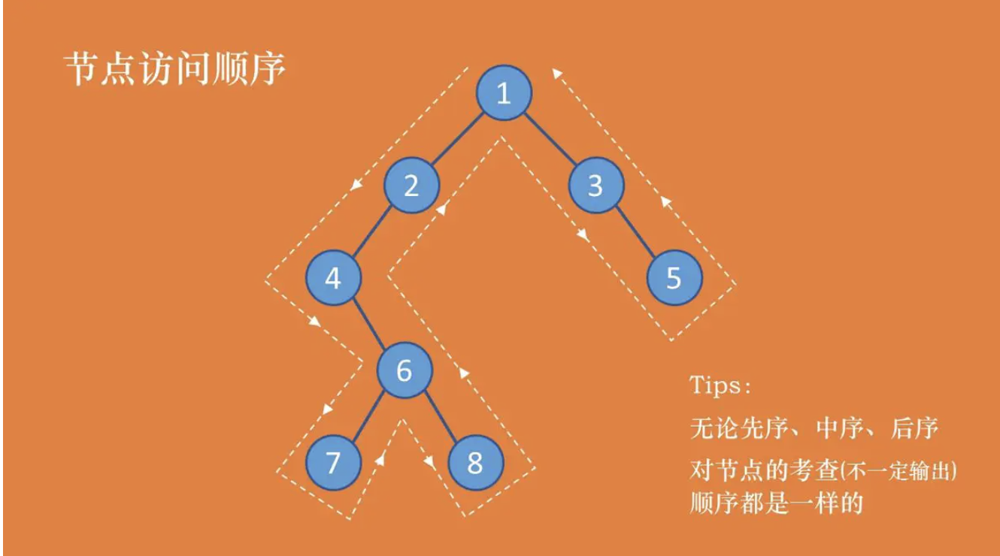

二叉树的先序、中序、后序遍历

<!--more-->

**树节点：**

```java
class TreeNode {
    int val;
    //左子树
    TreeNode left;
    //右子树
    TreeNode right;
    //构造方法
    TreeNode(int x) {
        val = x;
    }
}
```




> 先序：1 2 4 6 7 8 3 5
> 中序：4 7 6 8 2 1 3 5
> 后序：7 8 6 4 2 5 3 1

**先序：**考察到一个节点后，即刻输出该节点的值，并继续遍历其左右子树。(根左右)

**中序：**考察到一个节点后，将其暂存，遍历完左子树后，再输出该节点的值，然后遍历右子树。(左根右)

**后序：**考察到一个节点后，将其暂存，遍历完左右子树后，再输出该节点的值。(左右根)


#### 递归先序遍历

递归先序遍历很容易理解，先输出节点的值，再递归遍历左右子树。中序和后序的递归类似，改变根节点输出位置即可。

```csharp
// 递归先序遍历
public static void recursionPreorderTraversal(TreeNode root) {
    if (root != null) {
        System.out.print(root.val + " ");
        recursionPreorderTraversal(root.left);
        recursionPreorderTraversal(root.right);
    }
}
```

#### 非递归先序遍历

因为要在遍历完节点的左子树后接着遍历节点的右子树，为了能找到该节点，需要使用**栈**来进行暂存。中序和后序也都涉及到回溯，所以都需要用到**栈**。

```csharp
// 非递归先序遍历
public static void preorderTraversal(TreeNode root) {
    // 用来暂存节点的栈
    Stack<TreeNode> treeNodeStack = new Stack<TreeNode>();
    // 新建一个游标节点为根节点
    TreeNode node = root;
    // 当遍历到最后一个节点的时候，无论它的左右子树都为空，并且栈也为空
    // 所以，只要不同时满足这两点，都需要进入循环
    while (node != null || !treeNodeStack.isEmpty()) {
        // 若当前考查节点非空，则输出该节点的值
        // 由考查顺序得知，需要一直往左走
        while (node != null) {
            System.out.print(node.val + " ");
            // 为了之后能找到该节点的右子树，暂存该节点
            treeNodeStack.push(node);
            node = node.left;
        }
        // 一直到左子树为空，则开始考虑右子树
        // 如果栈已空，就不需要再考虑
        // 弹出栈顶元素，将游标等于该节点的右子树
        if (!treeNodeStack.isEmpty()) {
            node = treeNodeStack.pop();
            node = node.right;
        }
    }
}
```

> 递归先序遍历： 1 2 4 6 7 8 3 5
> 非递归先序遍历：1 2 4 6 7 8 3 5

#### 递归中序遍历

过程和递归先序遍历类似

```csharp
// 递归中序遍历
public static void recursionMiddleorderTraversal(TreeNode root) {
    if (root != null) {
        recursionMiddleorderTraversal(root.left);
        System.out.print(root.val + " ");
        recursionMiddleorderTraversal(root.right);
    }
}
```

#### 非递归中序遍历

和非递归先序遍历类似，唯一区别是考查到当前节点时，并不直接输出该节点。

而是当考查节点为空时，从栈中弹出的时候再进行输出(永远先考虑左子树，直到左子树为空才访问根节点)。

```csharp
// 非递归中序遍历
public static void middleorderTraversal(TreeNode root) {
    Stack<TreeNode> treeNodeStack = new Stack<TreeNode>();
    TreeNode node = root;
    while (node != null || !treeNodeStack.isEmpty()) {
        while (node != null) {
            treeNodeStack.push(node);
            node = node.left;
        }
        if (!treeNodeStack.isEmpty()) {
            node = treeNodeStack.pop();
            System.out.print(node.val + " ");
            node = node.right;
        }
    }
}
```

>递归中序遍历： 4 7 6 8 2 1 3 5
>非递归中序遍历：4 7 6 8 2 1 3 5

#### 递归后序遍历

过程和递归先序遍历类似

```csharp
// 递归后序遍历
public static void recursionPostorderTraversal(TreeNode root) {
    if (root != null) {
        recursionPostorderTraversal(root.left);
        recursionPostorderTraversal(root.right);
        System.out.print(root.val + " ");
    }
}
```

#### 非递归后序遍历

后续遍历和先序、中序遍历不太一样。

后序遍历在决定是否可以输出当前节点的值的时候，需要考虑其左右子树是否都已经遍历完成。

所以需要设置一个**lastVisit游标**。

若lastVisit等于当前考查节点的右子树，表示该节点的左右子树都已经遍历完成，则可以输出当前节点。

并把lastVisit节点设置成当前节点，将当前游标节点node设置为空，下一轮就可以访问栈顶元素。

**否者，需要接着考虑右子树，node = node.right。**

```csharp
// 非递归后序遍历
public static void postorderTraversal(TreeNode root) {
    Stack<TreeNode> treeNodeStack = new Stack<TreeNode>();
    TreeNode node = root;
    TreeNode lastVisit = root;
    while (node != null || !treeNodeStack.isEmpty()) {
        while (node != null) {
            treeNodeStack.push(node);
            node = node.left;
        }
        //查看当前栈顶元素
        node = treeNodeStack.peek();
        //如果其右子树也为空，或者右子树已经访问
        //则可以直接输出当前节点的值
        if (node.right == null || node.right == lastVisit) {
            System.out.print(node.val + " ");
            treeNodeStack.pop();
            lastVisit = node;
            node = null;
        } else {
            //否则，继续遍历右子树
            node = node.right;
        }
    }
}
```

>递归后序遍历： 7 8 6 4 2 5 3 1
>非递归后序遍历：7 8 6 4 2 5 3 1

